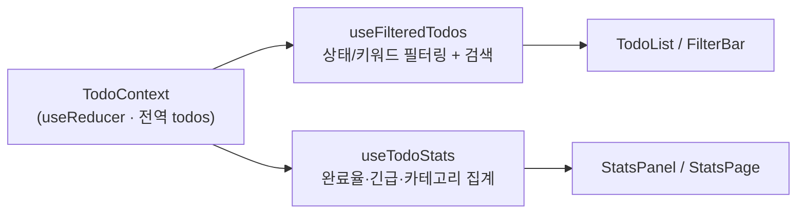

# Dayflow Todo

React + TypeScript로 만든 할 일 관리 웹 앱. 필터·검색·통계 대시보드를 갖추고, 상태 계산 로직을 **Custom Hook**으로 분리한 것이 핵심입니다.


---

## 🔗 데모

**라이브:** https://skywith628.github.io/todo-list/

<!-- TODO: 대시보드 스크린샷 1장 (docs/screenshot.png 등) 추가 -->

---

## 만든 이유

React의 **상태 관리**와 **관심사 분리(Separation of Concerns)** 를 직접 손에 익히기 위한 학습 프로젝트입니다.
"필터링·통계 계산 로직을 컴포넌트 밖으로 어떻게 깔끔하게 빼낼까"라는 질문에 Custom Hook으로 답하는 데 초점을 뒀습니다.

> 관심사 분리(Separation of Concerns): 화면 표현(UI)과 데이터 계산(로직)을 서로 다른 책임으로 나누는 설계 원칙. 분리하면 로직을 따로 테스트·재사용하기 쉬워집니다.

---

## 기술 스택

| 역할 | 기술 | 선정 이유 |
|------|------|-----------|
| UI 라이브러리 | React 19 | 컴포넌트 단위 UI + Hook으로 로직 재사용 |
| 언어 | TypeScript | 할 일 데이터의 타입(상태·우선순위)을 컴파일 단계에서 보장 |
| 빌드 도구 | Vite | 빠른 개발 서버(HMR)와 간단한 정적 빌드 |
| 라우팅 | React Router DOM (`HashRouter`) | GitHub Pages 같은 정적 호스팅에서 새로고침 404 없이 동작 |
| 전역 상태 | Context API + `useReducer` | 외부 라이브러리 없이 표준 React만으로 상태 중앙화 |
| 아이콘 | Lucide React | 가벼운 SVG 아이콘 세트 |
| 배포 | GitHub Pages (GitHub Actions) | `main` push 시 자동 빌드·배포 |

---

## 핵심 설계 — Custom Hook으로 상태 로직 분리

전역 할 일 데이터는 `TodoContext`(Context API + `useReducer`)에 한 곳으로 모으고,
**그 데이터를 가공하는 책임**을 두 개의 Custom Hook으로 나눴습니다. 컴포넌트는 결과만 받아 그리기만 합니다.



**책임 분리**

- **`useFilteredTodos`** — 필터(`all` / `todo` / `doing` / `done`)와 검색어 상태를 들고, `title·memo·category`를 대상으로 필터링한 목록을 반환. 입력이 안 바뀌면 `useMemo`로 재계산을 건너뜁니다.
- **`useTodoStats`** — 전체/완료 개수, 완료율(`progress`), 미완료 긴급 건수(`urgent`), 카테고리별 집계(`byCategory`)를 한 번에 계산. 역시 `useMemo`로 메모이즈.

```ts
// useTodoStats.ts — UI와 무관한 순수 집계 로직
export function useTodoStats() {
  const { todos } = useTodoContext();
  return useMemo(() => {
    const total = todos.length;
    const completed = todos.filter((t) => t.status === "done").length;
    const urgent = todos.filter((t) => t.priority === "high" && t.status !== "done").length;
    const progress = total === 0 ? 0 : Math.round((completed / total) * 100);
    // ...byCategory 집계
    return { total, completed, urgent, progress, byCategory };
  }, [todos]);
}
```

> 이렇게 빼두면 통계 화면(`StatsPage`)과 대시보드 패널(`StatsPanel`)이 같은 Hook을 공유하고, 계산 로직만 따로 테스트할 수 있습니다.

---

## 주요 기능

- 할 일 추가 / 상태 토글(완료) / 삭제, 상태값 변경 (`todo` / `doing` / `done`)
- 상태 필터링 + 키워드 검색 (제목·메모·카테고리 통합 검색)
- 통계 대시보드 — 완료율, 미완료 긴급 건수, 카테고리별 현황
- 페이지 라우팅 — 대시보드 / 상세 / 통계 / 로그인 / 404
- 반응형 UI

---

## 실행 방법

```bash
git clone https://github.com/SkyWith628/todo-list.git
cd todo-list/todo-list-github-pages
npm install
npm run dev   # http://localhost:5173
```

빌드:

```bash
npm run build   # tsc 타입체크 후 dist/ 정적 빌드
```

`main` 브랜치 push 시 GitHub Actions(`.github/workflows/deploy.yml`)가 자동으로 빌드·배포합니다.

---

## 한계 & 다음 단계

학습용 규모라 현재는 의도적으로 단순하게 두었습니다.

- **영속성 없음** — 상태가 메모리에만 존재해 새로고침 시 초기 데모 데이터로 돌아갑니다. → `localStorage` 연동이 다음 과제.
- **테스트 없음** — 로직을 Hook으로 분리해둔 만큼, `useTodoStats`·`useFilteredTodos`에 단위 테스트를 붙이기 좋은 구조입니다.
- 로그인은 화면(UI)만 존재하며 실제 인증은 구현돼 있지 않습니다.

---

## 라이선스

MIT License
